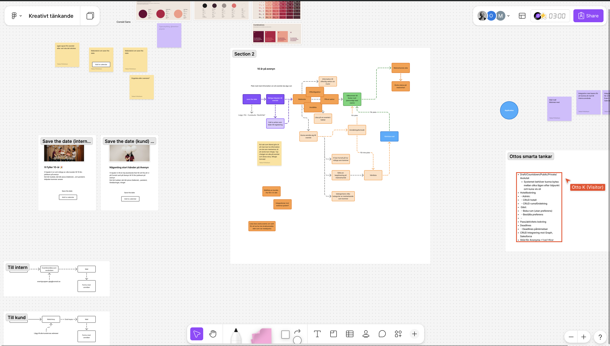
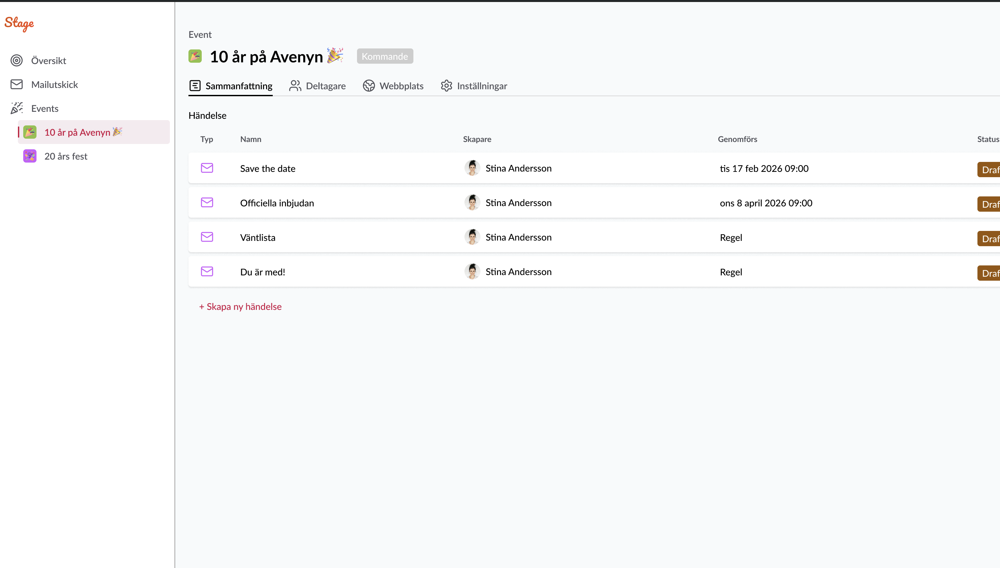
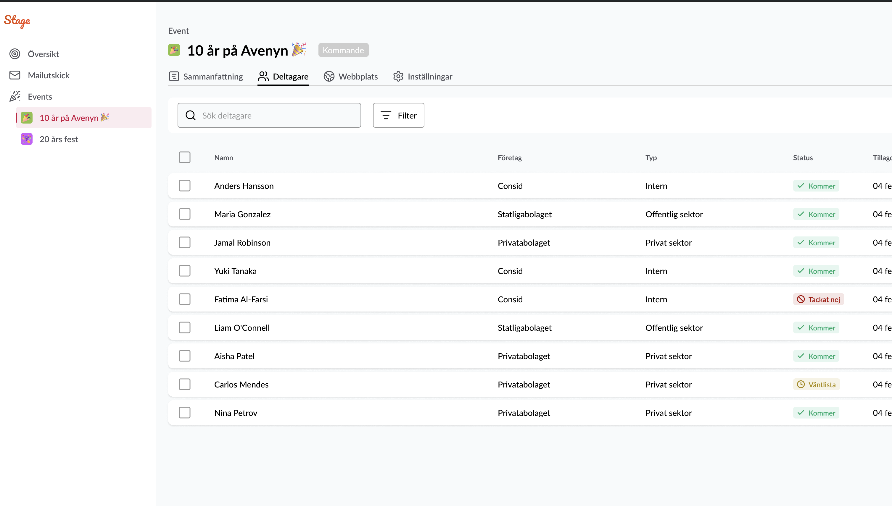
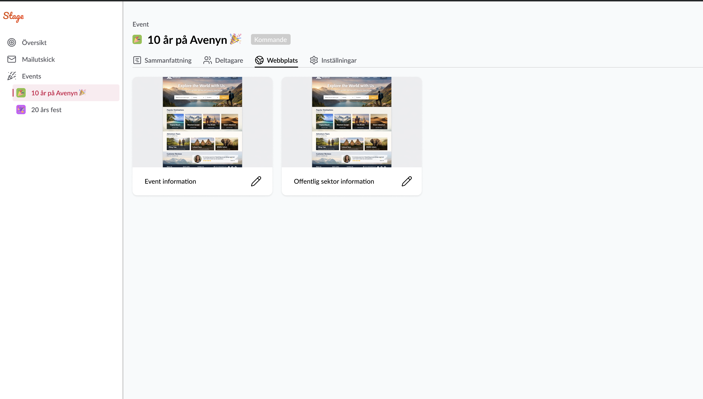

# PRD: Stage - Eventplaneringsplattform

**Version:** 1.0 (MVP)
**Datum:** 2026-02-19
**Produkt:** Stage
**Domän:** event.consid.se

---

## 1. Bakgrund & Problemformulering

Consid hanterar idag eventplanering med en kombination av manuella processer och Mailchimp. Detta skapar flera problem:

- **Mailchimp-begränsningar:** Kan inte skicka internt, kostnad per mottagare
- **Spridda verktyg:** Ingen samlad plats för deltagare, utskick, budget och webbsidor
- **Offentlig sektor:** Inget stöd för att hantera mutlagstiftning och transparens
- **Väntlistor:** Ingen automatiserad hantering av kapacitetsgränser

## 2. Vision

Stage ska vara en intern eventplaneringsplattform som gör det enkelt för icke-tekniska medarbetare att skapa, hantera och kommunicera evenemang - från AW:s till större kundevent - med inbyggt stöd för GDPR, offentlig sektor och snygga utskick.

## 3. Målgrupp

| Användare              | Beskrivning                                                                    |
| ---------------------- | ------------------------------------------------------------------------------ |
| **Eventskapare**       | Consid-medarbetare som planerar och driver event (ej nödvändigtvis IT-kunniga) |
| **Eventläsare**        | Medarbetare som behöver se eventinfo utan redigeringsrättigheter               |
| **Deltagare (intern)** | Consid-anställda som bjuds in                                                  |
| **Deltagare (extern)** | Kunder från privat och offentlig sektor                                        |

## 4. Avgränsningar (MVP)

- **Inget godkännandeflöde** - event som skapas är klara att användas
- **Webbplatsredigering via HTML** - blockbaserad editor kommer i senare version
- **Ingen betalningshantering** - budget är för intern uppföljning, ej biljettförsäljning
- **Ingen budget i MVP** - budgetfunktionalitet (E1-F6) skjuts till framtida version
- **Ingen delad kontaktdatabas** - uppladdade deltagarlistor hör till respektive event

---

## 5. Epics & Features

### Epic 1: Eventhantering

> _Skapa och hantera event genom hela dess livscykel - före, under och efter._

#### Features

| ID    | Feature              | Beskrivning                                                                                                                                                                        |
| ----- | -------------------- | ---------------------------------------------------------------------------------------------------------------------------------------------------------------------------------- |
| E1-F1 | Skapa event          | Skapa nytt event med namn, datum, plats, beskrivning, typ, maxantal deltagare och kontaktperson. Val för synlighet: dolt (enbart eventmedlemmar) eller synligt för alla på Consid. |
| E1-F2 | Eventöversikt        | Dashboard med aktiva, kommande och historiska event. Inkluderar krockkontroll som varnar vid överlappande event.                                                                   |
| E1-F3 | Eventsammanfattning  | Samlingssida per event med händelser, status och nyckeltal                                                                                                                         |
| E1-F4 | Händelsehantering    | Skapa och hantera händelser kopplade till eventet (utskick, aktiviteter, uppstädning etc.)                                                                                         |
| E1-F5 | Eventlivscykel       | Hantera faserna: förberedelse, pågående, efterarbete                                                                                                                               |
| E1-F6 | Budget               | Budgetplanering och uppföljning per event _(ej MVP)_                                                                                                                               |
| E1-F7 | Ta bort event        | Möjlighet att ta bort event permanent                                                                                                                                              |
| E1-F8 | Synlighet & döljning | Event kan vara dolda (enbart synliga för eventmedlemmar) eller synliga för alla Consid-anställda                                                                                   |
| E1-F9 | Global sökfunktion   | Sökfunktion i admingränssnittet för att söka på event och specifik information (ej deltagarsökning — deltagarsök finns i E2-F1)                                                    |

#### User Stories

**E1-F1: Skapa event**

- Som eventskapare vill jag kunna skapa ett nytt event med grundläggande information så att jag snabbt kommer igång med planeringen
- Som eventskapare vill jag kunna ange maxantal deltagare så att jag kan kontrollera kapaciteten
- Som eventskapare vill jag kunna välja om eventet ska ha en webbplats eller enbart mailutskick så att jag inte behöver göra mer än nödvändigt
- Som eventskapare vill jag kunna ange en kontaktperson för eventet så att deltagare vet vem de kan vända sig till
- Som eventskapare vill jag vid skapande kunna välja om eventet ska vara synligt för alla på Consid eller enbart för eventmedlemmar så att känsliga eller exklusiva event hålls privata

**E1-F2: Eventöversikt**

- Som eventskapare vill jag se en översikt över alla mina event så att jag snabbt hittar rätt event
- Som eventskapare vill jag se status (kommande, pågående, avslutat) för varje event så att jag vet var jag behöver agera
- Som eventskapare vill jag kunna se historiska (avslutade) event så att jag kan referera till tidigare genomförda event
- Som eventskapare vill jag få en varning om mitt event krockar (datum/plats) med ett annat event så att vi undviker konflikter

**E1-F3: Eventsammanfattning**

- Som eventskapare vill jag se alla händelser (utskick, aktiviteter) för ett event på en sida så att jag har överblick
- Som eventskapare vill jag se vem som skapat varje händelse och dess status (draft, skickad, planerad) så att teamet kan samarbeta

**E1-F4: Händelsehantering**

- Som eventskapare vill jag kunna lägga till nya händelser (t.ex. utskick, påminnelse, uppstädning) i ett event så att hela livscykeln är dokumenterad
- Som eventskapare vill jag kunna schemalägga händelser till specifikt datum/tid så att utskick går ut automatiskt
- Som eventskapare vill jag kunna skapa regelbaserade händelser (t.ex. "skicka väntliste-mail när plats frigörs") så att processen automatiseras

**E1-F5: Eventlivscykel**

- Som eventskapare vill jag kunna lägga till förberedande aktiviteter (boka lokal, beställa mat) så att inget glöms
- Som eventskapare vill jag kunna lägga till efterarbete (tackmejl, uppstädning, utvärdering) så att eventet avslutas ordentligt

**E1-F6: Budget** _(ej MVP)_

- Som eventskapare vill jag kunna sätta en budget per event och registrera kostnader så att jag har ekonomisk kontroll
- Som eventskapare vill jag se budgetstatus (planerat vs utfall) så att jag kan agera om budgeten överskrids

**E1-F7: Ta bort event**

- Som eventskapare vill jag kunna ta bort ett event som inte längre är aktuellt så att översikten hålls ren
- Som eventskapare vill jag få en bekräftelsedialog innan borttagning så att jag inte raderar ett event av misstag

**E1-F8: Synlighet & döljning**

- Som eventskapare vill jag kunna dölja ett event så att enbart tilldelade eventmedlemmar (redigerare/läsare) kan se det
- Som Consid-medarbetare vill jag kunna se event som är markerade som synliga för alla så att jag kan ta del av vad som händer på företaget

**E1-F9: Global sökfunktion**

- Som eventskapare vill jag kunna söka globalt i admingränssnittet på eventnamn, plats och datum så att jag snabbt hittar rätt event
- Som eventskapare vill jag se sökresultat i realtid (autocomplete) så att jag inte behöver navigera manuellt

---

### Epic 2: Deltagarhantering

> _Hantera inbjudna, anmälda, väntlistade och avböjda deltagare med stöd för olika kategorier._

#### Features

| ID    | Feature                     | Beskrivning                                                                                                                                                                                                                  |
| ----- | --------------------------- | ---------------------------------------------------------------------------------------------------------------------------------------------------------------------------------------------------------------------------- |
| E2-F1 | Deltagarregister            | Lista och filtrera deltagare per event med namn, företag, typ och status                                                                                                                                                     |
| E2-F2 | Deltagarkategorier          | Kategorisera deltagare som Intern, Offentlig sektor eller Privat sektor                                                                                                                                                      |
| E2-F3 | Väntlista & köhantering     | Automatisk väntlistehantering med stöd för överbokning. Eventskaparen kan manuellt ändra köordning (dra-och-släpp eller prioritet). Tidsinställda köregler: deadline för svar och maximal svarstid innan platsen går vidare. |
| E2-F4 | Statushantering             | Spåra deltagarstatus: Inbjuden, Kommer, Tackat nej, Väntlista, Avbokad                                                                                                                                                       |
| E2-F5 | Import av deltagare         | Importera deltagare via CSV/Excel (per event, ej delad) eller integration med Pipedrive                                                                                                                                      |
| E2-F6 | GDPR-hantering              | Informera deltagare om datahantering och hantera samtycke                                                                                                                                                                    |
| E2-F7 | +1 / Vidarebjudan           | Möjlighet för deltagare att ta med en extra gäst (+1) eller vidarebefordra sin inbjudan till annan person _(ej MVP)_                                                                                                         |
| E2-F8 | Deltagarpreferenser         | Formulär för att samla in specifika önskemål från deltagare, t.ex. matallergier, alkoholfritt, tillgänglighetsbehov _(ej MVP)_                                                                                               |
| E2-F9 | Kötransparens för deltagare | Deltagare kan via länk se sin aktuella plats i väntlistan _(ej MVP)_                                                                                                                                                         |

#### User Stories

**E2-F1: Deltagarregister**

- Som eventskapare vill jag se en lista med alla deltagare, deras företag och status så att jag har full översikt
- Som eventskapare vill jag kunna söka och filtrera deltagare (på namn, företag, typ, status) så att jag snabbt hittar rätt person

**E2-F2: Deltagarkategorier**

- Som eventskapare vill jag kunna kategorisera deltagare som Intern, Offentlig sektor eller Privat sektor så att jag kan anpassa kommunikationen och säkerställa korrekt hantering
- Som eventskapare vill jag att offentlig sektor-deltagare automatiskt flaggas så att vi säkerställer att mutlagstiftningen efterlevs

**E2-F3: Väntlista & köhantering**

- Som eventskapare vill jag att deltagare automatiskt hamnar på väntlista när maxantal uppnåtts så att jag inte behöver hantera det manuellt
- Som eventskapare vill jag kunna konfigurera överbokning med ett procenttal eller antal platser (t.ex. 5% eller 10 extra) så att vi fyller alla platser trots avhopp
- Som eventskapare vill jag att väntlistade deltagare automatiskt får bekräftelse när en plats frigörs så att processen är sömlös
- Som eventskapare vill jag kunna ändra köordningen manuellt (via dra-och-släpp eller prioritetsvärde) så att jag kan prioritera viktiga deltagare
- Som eventskapare vill jag kunna sätta en svarsfrist (deadline) för väntlistade deltagare så att platsen automatiskt går vidare till nästa person om svar uteblir
- Som eventskapare vill jag kunna konfigurera maximal svarstid (t.ex. 48h) när en väntlistad deltagare erbjuds plats så att kön inte stannar upp

**E2-F4: Statushantering**

- Som eventskapare vill jag se deltagarstatus i realtid (Kommer, Tackat nej, Väntlista, Avbokad) så att jag vet hur många som bekräftat

**E2-F5: Import av deltagare**

- Som eventskapare vill jag kunna ladda upp en CSV/Excel-fil med deltagare så att jag snabbt får in stora mängder kontakter
- Som eventskapare vill jag att uppladdade deltagarlistor enbart är kopplade till det aktuella eventet så att kontaktdata inte delas mellan event
- Som eventskapare vill jag kunna importera kontakter från Pipedrive så att kunddatabasen inte behöver dubbelregistreras

**E2-F6: GDPR-hantering**

- Som deltagare vill jag vid anmälan se tydlig information om hur mina personuppgifter används så att jag kan ge informerat samtycke
- Som deltagare vill jag kunna återkalla mitt samtycke varpå mina personuppgifter raderas och jag avbokas från eventuella kommande event så att mina rättigheter enligt GDPR respekteras
- Som eventskapare vill jag att GDPR-information automatiskt inkluderas i anmälningsflödet så att vi alltid följer regelverket

**E2-F7: +1 / Vidarebjudan** _(ej MVP)_

- Som deltagare vill jag kunna ange att jag tar med en extra gäst (+1) vid anmälan så att min partner/kollega också kan delta
- Som deltagare vill jag kunna vidarebefordra min inbjudan till en annan person om jag inte kan delta själv

**E2-F8: Deltagarpreferenser** _(ej MVP)_

- Som deltagare vill jag kunna ange matallergier och kostpreferenser vid anmälan så att arrangören kan planera måltider
- Som deltagare vill jag kunna ange om jag önskar alkoholfritt alternativ så att det finns tillgängligt vid eventet
- Som eventskapare vill jag kunna konfigurera vilka preferensfält som visas per event så att formuläret inte blir onödigt långt

**E2-F9: Kötransparens för deltagare** _(ej MVP)_

- Som väntlistad deltagare vill jag via en länk kunna se min aktuella plats i kön så att jag vet om jag har chans att få plats

---

### Epic 3: Mailutskick

> _Ersätta Mailchimp med egna snygga mailutskick - internt och externt - utan kostnad per mottagare._

#### Features

| ID    | Feature                      | Beskrivning                                                                                                                                                                        |
| ----- | ---------------------------- | ---------------------------------------------------------------------------------------------------------------------------------------------------------------------------------- |
| E3-F1 | Mailmallar                   | Färdiga mallar: Save the date, Officiell inbjudan, Väntlista-mail, Bekräftelse ("Du är med!")                                                                                      |
| E3-F2 | Drag-and-drop mailredigering | Visuell blockredigerare likt Mailchimp - dra och släpp innehållsblock (text, bild, knapp, avdelare, kolumner) för att bygga mail. Färdiga mallar i Consid-profil som utgångspunkt. |
| E3-F3 | Segmenterade utskick         | Skicka till specifika grupper baserat på deltagarkategori och status                                                                                                               |
| E3-F4 | Schemaläggning               | Schemalägga utskick till specifikt datum och tid                                                                                                                                   |
| E3-F5 | Utskicksöversikt             | Se status på alla utskick (draft, schemalagd, skickad) per event                                                                                                                   |
| E3-F6 | Valbar avsändarbrevlåda      | Välja avsändarbrevlåda per event (t.ex. event.gbg@consid.se, event.syd@consid.se) via MS 365                                                                                       |
| E3-F7 | Studshantering (bounce)      | Hantera mail som studsar - flagga ogiltiga adresser och notifiera eventskaparen                                                                                                    |
| E3-F8 | SMS-utskick                  | Stöd för att skicka påminnelser och bekräftelser via SMS som komplement till e-post _(ej MVP)_                                                                                     |

#### User Stories

**E3-F1: Mailmallar**

- Som eventskapare vill jag kunna välja bland färdiga mailmallar (Save the date, Officiell inbjudan, Väntlista, Bekräftelse) så att jag snabbt skapar professionella utskick
- Som eventskapare vill jag att mallarnas design följer Consids grafiska profil så att utskicken ser professionella ut

**E3-F2: Drag-and-drop mailredigering**

- Som eventskapare vill jag kunna bygga mail visuellt med drag-and-drop av innehållsblock (text, bild, knapp, avdelare, kolumner) så att jag skapar snygga mail utan teknisk kunskap
- Som eventskapare vill jag kunna utgå från en färdig mall och anpassa den genom att lägga till, ta bort och flytta block så att jag snabbt kommer igång
- Som eventskapare vill jag kunna redigera text, byta bilder och ändra färger direkt i den visuella editorn så att jag har full kontroll över utseendet
- Som eventskapare vill jag kunna förhandsgranska mailet (desktop och mobil) innan det skickas så att jag ser hur det ser ut för mottagaren
- Som eventskapare vill jag kunna ladda upp egna bilder och logotyper till mailet så att innehållet blir relevant och engagerande

**E3-F3: Segmenterade utskick**

- Som eventskapare vill jag kunna skicka olika mail till interna, offentlig sektor och privat sektor-deltagare så att kommunikationen är anpassad
- Som eventskapare vill jag kunna skicka mail enbart till väntlistade deltagare så att jag kan kommunicera med rätt grupp

**E3-F4: Schemaläggning**

- Som eventskapare vill jag kunna schemalägga utskick i förväg så att de går ut vid rätt tidpunkt utan manuell insats

**E3-F5: Utskicksöversikt**

- Som eventskapare vill jag se status (Draft, Schemalagd, Skickad) på alla utskick för ett event så att jag vet vad som skickats och vad som väntar

**E3-F6: Valbar avsändarbrevlåda**

- Som eventskapare vill jag kunna välja vilken delad brevlåda (t.ex. event.gbg@consid.se, event.syd@consid.se) som mail skickas från så att utskicket kommer från rätt lokal avsändare
- Som eventskapare vill jag att vald avsändarbrevlåda gäller för hela eventet så att all kommunikation är konsekvent

**E3-F7: Studshantering (bounce)**

- Som eventskapare vill jag bli notifierad när mail studsar (ogiltig adress, full brevlåda etc.) så att jag kan åtgärda kontaktinformationen
- Som eventskapare vill jag att studsade mailadresser flaggas i deltagarlistan så att jag enkelt ser vilka som inte nåtts

**E3-F8: SMS-utskick** _(ej MVP)_

- Som eventskapare vill jag kunna skicka SMS-påminnelser till deltagare som komplement till e-post så att viktig information når fram även om mail missas
- Som eventskapare vill jag kunna välja kanal (e-post, SMS eller båda) per utskick så att jag har flexibilitet i kommunikationen

---

### Epic 4: Eventwebbplats

> _Möjlighet att skapa en enkel webbsida per event på event.consid.se._

#### Features

| ID    | Feature                      | Beskrivning                                                                                                                                                  |
| ----- | ---------------------------- | ------------------------------------------------------------------------------------------------------------------------------------------------------------ |
| E4-F1 | Webbplatsskapare             | Skapa en enkel webbsida per event med eventinfo                                                                                                              |
| E4-F2 | Offentlig sektor-sida        | Separat informationssida för offentlig sektor-deltagare                                                                                                      |
| E4-F3 | HTML-redigering (MVP)        | Redigera webbsidans innehåll via HTML med färdiga block                                                                                                      |
| E4-F4 | Anmälningsformulär           | Anmälningsformulär inbäddat i webbsidan med GDPR-samtycke                                                                                                    |
| E4-F5 | Deltagarportal för avbokning | Personlig länk (unik token per deltagare) där deltagare kan se sin status och avboka sin plats. Kräver ingen inloggning — länken fungerar som autentisering. |

#### User Stories

**E4-F1: Webbplatsskapare**

- Som eventskapare vill jag kunna skapa en webbsida för mitt event på event.consid.se/[eventnamn] så att deltagare har en central plats för information
- Som eventskapare vill jag kunna välja om eventet ska ha en webbsida eller ej så att enklare event bara använder mailutskick

**E4-F2: Offentlig sektor-sida**

- Som eventskapare vill jag kunna skapa en separat informationssida för offentlig sektor-deltagare så att det tydligt framgår att eventet inte utgör muta
- Som deltagare från offentlig sektor vill jag se tydlig information om eventets syfte, kostnad och arrangör så att jag kan bedöma om deltagande är förenligt med min tjänst

**E4-F3: HTML-redigering (MVP)**

- Som eventskapare vill jag kunna redigera webbsidans innehåll med färdiga HTML-block (hero, text, bild, schema, platsinfo) så att jag snabbt bygger en snygg sida
- Som eventskapare vill jag kunna förhandsgranska webbsidan innan publicering så att jag ser hur den ser ut för besökare

**E4-F4: Anmälningsformulär**

- Som deltagare vill jag kunna anmäla mig via webbsidan med namn, e-post och företag så att jag enkelt bekräftar min närvaro
- Som deltagare vill jag vid anmälan se GDPR-information och kunna ge samtycke så att mina rättigheter respekteras

**E4-F5: Deltagarportal för avbokning**

- Som deltagare vill jag via en personlig länk (i bekräftelsemailet) kunna se min anmälningsstatus och avboka min plats så att jag enkelt kan ändra mig
- Som deltagare vill jag få en bekräftelse när avbokningen gått igenom så att jag vet att platsen frigjorts
- Som eventskapare vill jag att avbokningar automatiskt triggar väntlistelogiken så att nästa person i kön erbjuds platsen

---

### Epic 5: Behörigheter & Roller

> _Hantera vem som får skapa, redigera och läsa event._

#### Features

| ID    | Feature              | Beskrivning                                       |
| ----- | -------------------- | ------------------------------------------------- |
| E5-F1 | Roller               | Minst två roller: Redigerare och Läsare per event |
| E5-F2 | Eventnivå-behörighet | Tilldela behörigheter per event (inte globalt)    |

#### User Stories

**E5-F1: Roller**

- Som eventskapare vill jag kunna bjuda in kollegor som redigerare på mitt event så att vi kan samarbeta
- Som eventskapare vill jag kunna ge kollegor läsbehörighet så att de kan följa eventet utan att oavsiktligt ändra något

**E5-F2: Eventnivå-behörighet**

- Som eventskapare vill jag hantera behörigheter per event så att rätt personer har åtkomst till rätt event

---

### Epic 6: Integrationer & Dataimport

> _Koppla Stage till befintliga system för att undvika dubbelarbete._

#### Features

| ID    | Feature                   | Beskrivning                                                                                                                                                                                                   | MVP? |
| ----- | ------------------------- | ------------------------------------------------------------------------------------------------------------------------------------------------------------------------------------------------------------- | ---- |
| E6-F1 | CSV/Excel-import          | Ladda upp kontaktlistor via fil                                                                                                                                                                               | Ja   |
| E6-F2 | Pipedrive-integration     | Synka kunddata från Pipedrive                                                                                                                                                                                 | TBD  |
| E6-F3 | MS 365-integration (mail) | Skicka mail via Consids MS 365-miljö med delade brevlådor                                                                                                                                                     | Ja   |
| E6-F4 | Kalenderintegration (ICS) | Generera ICS-filer för event och bifoga i bekräftelsemail. Stöd för både externa och interna event. Deltagare kan lägga till eventet i Outlook/Google Calendar via ICS-fil eller "Lägg till i kalender"-länk. | Ja   |
| E6-F5 | Considevent-appen         | Synkning med den befintliga Consid eventappen för att undvika parallella system _(ej MVP)_                                                                                                                    |

#### User Stories

**E6-F1: CSV/Excel-import**

- Som eventskapare vill jag kunna ladda upp en Excel- eller CSV-fil med deltagare (namn, e-post, företag, typ) så att jag snabbt får in deltagare utan manuell registrering

**E6-F2: Pipedrive-integration**

- Som eventskapare vill jag kunna söka och importera kontakter direkt från Pipedrive så att kunddatabasen hålls synkad

**E6-F3: MS 365-integration (mail)**

- Som systemägare vill jag att Stage skickar mail via Consids MS 365-miljö med delade brevlådor (t.ex. event.gbg@consid.se, event.syd@consid.se) så att vi slipper Mailchimps kostnader och begränsningar
- Som systemägare vill jag att Stage hanterar studsade mail (bounces) via MS 365 och flaggar ogiltiga adresser så att vi har god mailhygien

**E6-F4: Kalenderintegration (ICS)**

- Som deltagare vill jag att bekräftelsemailet innehåller en ICS-fil så att jag kan lägga till eventet i min kalender med ett klick
- Som deltagare vill jag se en "Lägg till i kalender"-länk på eventwebbsidan så att jag kan spara datumet även utan mail
- Som eventskapare vill jag att ICS-filen automatiskt genereras med rätt datum, tid, plats och beskrivning så att jag inte behöver skapa kalenderinbjudningar manuellt

**E6-F5: Considevent-appen** _(ej MVP)_

- Som systemägare vill jag att Stage synkar eventdata med den befintliga Consid eventappen så att deltagare kan se sina event på ett ställe
- Som deltagare vill jag se event från Stage i Consid eventappen så att jag inte behöver använda två system

---

## 6. Informationsmodell (översikt)

```
Event
├── Namn, datum, plats, beskrivning
├── Typ (intern/extern/blandad)
├── Maxantal deltagare
├── Överbokningsgräns (% eller antal)
├── Budget (ej MVP)
├── Kontaktperson
├── Synlighet (dolt / synligt för alla på Consid)
├── Avsändarbrevlåda (t.ex. event.gbg@consid.se)
│
├── Händelser (1..n)
│   ├── Typ (utskick, aktivitet, påminnelse)
│   ├── Skapare
│   ├── Datum/tid eller regel (trigger)
│   └── Status (draft, schemalagd, genomförd)
│
├── Deltagare (0..n) — isolerade per event
│   ├── Namn, e-post, företag
│   ├── Kategori (Intern / Offentlig sektor / Privat sektor)
│   ├── Status (Inbjuden / Kommer / Tackat nej / Väntlista / Avbokad)
│   ├── Köposition (ordningsnummer, redigerbart av eventskapare)
│   ├── Svarsfrist (deadline för att tacka ja från väntlista)
│   ├── Avbokningslänk (unik token)
│   ├── Mailadress-status (ok / studsad)
│   ├── GDPR-samtycke (datum)
│   └── Tillagd (datum)
│
├── Webbplats (0..1)
│   ├── Event information-sida
│   ├── Offentlig sektor-sida
│   └── Anmälningsformulär
│
└── Behörigheter (1..n)
    ├── Användare
    └── Roll (Skapare / Redigerare / Läsare)
```

## 7. Icke-funktionella krav

| Område               | Krav                                                                                                                                                                                                                                                                                                           |
| -------------------- | -------------------------------------------------------------------------------------------------------------------------------------------------------------------------------------------------------------------------------------------------------------------------------------------------------------- |
| **Användbarhet**     | Enkelt för icke-tekniska medarbetare. Minimal inlärningskurva. Onboarding/wizard för nya användare. Meningsfulla tomma tillstånd. Progressiv komplexitet (avancerade funktioner är opt-in).                                                                                                                    |
| **GDPR**             | DPIA innan lansering. Differentierad rättslig grund per deltagarkategori. Definierade lagringstider med automatisk radering. Integritetspolicy på event.consid.se. Avregistreringslänk i alla externa mail. Stöd för rätt till radering, registerutdrag och dataportabilitet. PuB-avtal med alla tredjeparter. |
| **Offentlig sektor** | Obligatoriska fält: program/agenda, kostnad per deltagare (uppdelat), betalningsmodell, arrangör. Nedladdningsbar PDF-sammanfattning.                                                                                                                                                                          |
| **Autentisering**    | OAuth 2.0/OIDC via Microsoft Entra ID (Azure AD). MFA enligt organisationspolicy. Sessionstimeout 30 min. Automatisk deprovisionering vid avslutad anställning.                                                                                                                                                |
| **Auktorisering**    | Behörighetskontroll på serversidan för varje API-anrop. Principen om minsta behörighet. Systemadmin-roll för plattformsförvaltning.                                                                                                                                                                            |
| **Kryptering**       | TLS 1.2+ för all datatrafik. HSTS. Kryptering av persondata i vila (AES-256/TDE).                                                                                                                                                                                                                              |
| **API-säkerhet**     | Rate limiting, CORS-restriktion, CSRF-skydd, input-validering serversida. Säkerhetshuvuden (CSP, X-Frame-Options, X-Content-Type-Options).                                                                                                                                                                     |
| **Filuppladdning**   | Vitlistade filtyper, max filstorlek, XXE-skydd vid Excel, genererade filnamn, bildåterkodning.                                                                                                                                                                                                                 |
| **E-postsäkerhet**   | SPF, DKIM, DMARC korrekt konfigurerade. Signerade/unika länkar per mottagare. Graph API-scope begränsat till godkända brevlådor. Credentials i Azure Key Vault.                                                                                                                                                |
| **Tillgänglighet**   | Eventwebbsidor och anmälningsformulär ska uppfylla WCAG 2.1 AA. Mailutskick ska vara tillgängliga (alt-texter, semantisk HTML, tillräcklig kontrast).                                                                                                                                                          |
| **Responsivitet**    | Eventwebbsidor och anmälningsformulär ska vara fullt responsiva. Admin-gränssnitt optimerat för desktop men med läsvy för mobil.                                                                                                                                                                               |
| **Prestanda**        | Webbsidor på event.consid.se ska ladda under 2s. Mail ska levereras inom 5 min.                                                                                                                                                                                                                                |
| **Loggning**         | Tamper-proof loggar för autentisering, behörighetsändringar, dataåtkomst och utskick. Bevaringstid minst 12 månader.                                                                                                                                                                                           |
| **Test**             | Penetrationstest innan lansering och därefter årligen.                                                                                                                                                                                                                                                         |
| **Domän**            | Eventwebbsidor publiceras på event.consid.se                                                                                                                                                                                                                                                                   |
| **Skalbarhet**       | Hantera event med upp till ~200+ deltagare och parallella event                                                                                                                                                                                                                                                |

## 8. Öppna frågor

| #   | Fråga                                                                                                                   | Status |
| --- | ----------------------------------------------------------------------------------------------------------------------- | ------ |
| 1   | Vilka delade brevlådor finns i MS 365 idag? Vilka behöver skapas? (t.ex. event.gbg, event.syd, event.sthlm)             | Öppen  |
| 2   | Ska Pipedrive-integration vara med i MVP eller version 2?                                                               | Öppen  |
| 3   | Vilken autentisering/SSO-lösning används på Consid idag?                                                                | Öppen  |
| 4   | Hur ska överbokningsgränsen fungera i detalj? (Automatisk uppflyttning från väntlista vid avhopp?)                      | Öppen  |
| 5   | Behöver vi spåra öppningsfrekvens/klickfrekvens på mail?                                                                | Öppen  |
| 6   | Ska det finnas stöd för flera språk (svenska/engelska)?                                                                 | Öppen  |
| 7   | Vem äger/förvaltar Stage efter lansering?                                                                               | Öppen  |
| 8   | Ska det finnas notifikationer till eventskapare (t.ex. "10 nya anmälningar")?                                           | Öppen  |
| 9   | Hur hanteras avregistrering/avbokning av deltagare?                                                                     | Öppen  |
| 10  | Ska budget kunna kopplas till faktiska kostnader (integration med ekonomisystem) eller är det rent manuellt?            | Öppen  |
| 11  | Vad ska hända vid eventkrock? Enbart varning, eller ska det blockera skapande? Krock på datum, plats eller båda?        | Öppen  |
| 12  | Ska borttagna event vara mjukraderade (återställningsbara) eller permanent borttagna?                                   | Öppen  |
| 13  | Vilka MS 365-behörigheter (Graph API-scope) behövs för att skicka mail via delade brevlådor?                            | Öppen  |
| 14  | Hur ska kontaktperson visas? Namn + mail + telefon, eller räcker namn + mail?                                           | Öppen  |
| 15  | Vilken drag-and-drop mailredigerare ska användas? Bygga eget vs befintligt bibliotek (Unlayer, GrapeJS, MJML, Beefree)? | Öppen  |

---

## 9. MVP-scope (förslag)

### Inkluderat i MVP

- Skapa, ta bort och hantera event med kontaktperson (E1-F1 till E1-F5, E1-F7, E1-F8)
- Global sökfunktion för event (E1-F9)
- Historiska event och eventkrockkontroll (E1-F2)
- Synlighet/döljning av event (E1-F8)
- Deltagarhantering med kategorier och väntlista med köhantering (E2-F1 till E2-F4)
- Väntlista med redigerbar köordning, svarsfrist och tidsinställda köregler (E2-F3)
- Deltagarlistor isolerade per event (E2-F5)
- Mailutskick med mallar, schemaläggning och valbar avsändarbrevlåda (E3)
- Studshantering (E3-F7)
- Enkel webbplats med HTML-redigering (E4)
- Deltagarportal för avbokning via personlig länk (E4-F5)
- Grundläggande behörigheter (E5)
- CSV/Excel-import (E6-F1)
- MS 365-mailintegration (E6-F3)
- Kalenderintegration med ICS-filer i bekräftelsemail (E6-F4)

### Framtida versioner

- Budget (E1-F6)
- +1 / Vidarebjudan av inbjudan (E2-F7)
- Deltagarpreferenser — matallergier, alkoholfritt m.m. (E2-F8)
- Kötransparens — deltagare ser sin plats i väntlistan (E2-F9)
- SMS-utskick (E3-F8)
- Blockbaserad webbplatsredigering (drag-and-drop)
- Pipedrive-integration (E6-F2)
- Integration med Considevent-appen (E6-F5)
- Avancerad statistik (öppningsfrekvens, klick)
- Godkännandeflöde för event
- Notifikationer
- Flerspråksstöd

---

## 10. Utvecklingsstrategi: AI-driven vs traditionell

### Bakgrund

Stage kan byggas med två fundamentalt olika ansatser: **AI-driven utveckling** (med Claude Opus 4.6 / Claude Code som primärt utvecklingsverktyg, styrt av en teknisk person) eller **traditionell utveckling** (med ett team av utvecklare). Nedan jämförs alternativen.

### Alternativ A: AI-driven utveckling (Claude Opus 4.6)

**Upplägg:** 1-2 tekniskt kunniga personer använder Claude Code / Opus 4.6 som par-programmerare. AI:n genererar kod, arkitektur, tester och dokumentation. Människan styr, granskar och fattar beslut.

| Fördelar                                                                                                                               | Nackdelar                                                                                                                                                                                           |
| -------------------------------------------------------------------------------------------------------------------------------------- | --------------------------------------------------------------------------------------------------------------------------------------------------------------------------------------------------- |
| **Snabbhet:** Kan generera stora mängder kod på kort tid. En fas 1-prototyp kan potentiellt stå klar på veckor istället för månader.   | **Kvalitetskontroll:** AI-genererad kod kräver noggrann granskning. Subtila buggar, säkerhetsluckor eller arkitekturmisstag kan smyga igenom.                                                       |
| **Kostnad:** Väsentligt lägre personalkostnad. 1-2 personer istället för ett team på 3-5.                                              | **Kompetenskrav på styrpersonen:** Den person som styr AI:n måste ha djup teknisk förståelse för att bedöma kodkvalitet, arkitektur och säkerhet. "Billigt" bara om rätt person styr.               |
| **Bredd:** AI:n behärskar hela stacken -- frontend, backend, databas, infrastruktur, tester -- utan att behöva specialister per lager. | **Kontext och kontinuitet:** AI:n har inget långtidsminne mellan sessioner. Komplexa beslut och arkitekturval måste dokumenteras noggrant för att undvika inkonsistens.                             |
| **Dokumentation:** Kan generera teknisk dokumentation, API-specifikationer och användarguider parallellt med koden.                    | **Integrationer:** MS 365 Graph API, Azure AD, och mailredigerare (Unlayer) kräver trial-and-error med verkliga API:er. AI:n kan generera integrationskod men inte testa mot live-miljöer autonomt. |
| **Iteration:** Snabba iterationer -- ändra krav, generera ny kod, testa. Låg kostnad att "börja om" på en komponent.                   | **Förvaltning:** Vem underhåller AI-genererad kod långsiktigt? Om den styrande personen slutar -- förstår nästa person kodbasen?                                                                    |
| **Tillgänglighet:** Kan arbeta dygnet runt, parallellt med flera uppgifter.                                                            | **Ansvar och ägarskap:** Svårare att peka på vem som "äger" en specifik lösning. Ingen utvecklare som kan förklara varför ett visst val gjordes.                                                    |
| **Experimentvänligt:** Låg kostnad att bygga PoC:er och prototyper. Perfekt för att validera MS 365-integrationen tidigt.              | **Testning i verkligheten:** AI:n kan skriva enhetstester men inte testa rendering i Outlook, användarupplevelse på mobil, eller prestanda under last. Kräver mänsklig testning.                    |

### Alternativ B: Traditionellt utvecklingsteam

**Upplägg:** Team på 3-5 personer (fullstack-utvecklare, frontendutvecklare, UX-designer) arbetar i sprintar under en produktägare.

| Fördelar                                                                                                                            | Nackdelar                                                                                                               |
| ----------------------------------------------------------------------------------------------------------------------------------- | ----------------------------------------------------------------------------------------------------------------------- |
| **Erfarenhet och omdöme:** Erfarna utvecklare fattar arkitekturbeslut baserade på erfarenhet, inte mönstermatchning.                | **Kostnad:** 3-5 utvecklare x 3-6 månader = betydande investering (1-3 MSEK+).                                          |
| **Förvaltningsbar kod:** Teamet skriver kod som teamet förstår och kan underhålla. Kunskapsdelning sker naturligt.                  | **Tid:** Traditionell MVP tar vanligtvis 3-6 månader. Längre kalenderid än AI-driven approach.                          |
| **Säkerhet:** Utvecklare med säkerhetskompetens kan identifiera och åtgärda risker proaktivt (XSS, injection, behörighetsbrister).  | **Rekrytering/tillgänglighet:** Att hitta och allokera rätt kompetens (Graph API, mailrendering, React) kan vara svårt. |
| **UX-kvalitet:** En dedikerad UX-designer säkerställer att gränssnittet verkligen fungerar för icke-tekniska användare.             | **Koordinering:** Fler personer = mer kommunikation, möten, merge-konflikter, beroenden.                                |
| **Testning:** Manuell och utforskande testning av erfarna testare. Riktiga användartester med riktiga medarbetare.                  | **Rigiditet:** Större tröghet att ändra riktning. Krav som ändras sent kostar mer att implementera.                     |
| **Trovärdighet:** Consid är ett IT-konsultbolag -- att bygga med ett riktigt team signalerar kvalitet och professionalitet internt. | **Specialistkompetens:** HTML-mailrendering och MS 365 Graph API är nischkompetenser som teamet kanske inte har.        |

### Alternativ C: Hybrid (rekommenderas)

**Upplägg:** Kombinera AI-driven utveckling med mänsklig expertis. AI:n genererar grundkod snabbt, medan människor fokuserar på det AI:n inte kan göra.

| Fas                  | AI:ns roll                                                                                  | Människans roll                                                            |
| -------------------- | ------------------------------------------------------------------------------------------- | -------------------------------------------------------------------------- |
| **PoC / Prototyp**   | Generera fullständig prototyp inkl. backend, frontend, databasschema, Graph API-integration | Validera mot verklig MS 365-miljö. Testa UX med riktiga användare.         |
| **Fas 1 utveckling** | Generera features, skriva tester, bygga API:er, skapa mailmallar i Consid-profil            | Kodgranskning, säkerhetsgranskning, arkitekturbeslut, integrationstestning |
| **UX & Design**      | Generera UI-komponenter, responsiv CSS, tillgänglighetsanpassning                           | UX-designer validerar flöden, gör användartester, sätter designsystem      |
| **Säkerhet**         | Implementera autentisering, input-validering, CSP-headers, kryptering                       | Penetrationstest, GDPR-granskning med DPO, hotmodellering                  |
| **Förvaltning**      | Generera buggfixar, mindre features, dokumentation                                          | Ägarskap, prioritering, användarrelation                                   |

**Fördelar med hybrid:**

- **Snabbhet + kvalitet:** AI:n ger hastighet, människan ger omdöme
- **Kostnadseffektivt:** 1-2 tekniska personer + AI istället för 3-5 utvecklare
- **Bäst av två världar:** AI:n hanterar repetitivt kodarbete, människan hanterar kreativa beslut, säkerhet och UX
- **Kompetensutveckling:** Teamet lär sig använda AI som verktyg -- kunskap som har värde i alla framtida projekt

**Risker med hybrid:**

- Kräver att styrpersonen är tillräckligt senior för att bedöma AI-genererad kod
- Ny arbetsmetod som kan ta tid att optimera
- Fortfarande behov av manuell testning, UX-validering och säkerhetsgranskning

### Kostnadsjämförelse (uppskattning)

|                           |      AI-driven (A)       |     Traditionell (B)     |       Hybrid (C)        |
| ------------------------- | :----------------------: | :----------------------: | :---------------------: |
| **Team**                  |       1-2 personer       |       3-5 personer       |    1-2 personer + AI    |
| **Tidsram Fas 1**         |        3-5 veckor        |        6-8 veckor        |       4-6 veckor        |
| **Personalkostnad Fas 1** |       ~150-300 tkr       |      ~600-1200 tkr       |      ~200-400 tkr       |
| **AI/verktygs-kostnad**   |        ~5-15 tkr         |            ~0            |        ~5-15 tkr        |
| **UX-kvalitet**           |          Medel           |           Hög            | Hög (med UX-validering) |
| **Säkerhetsnivå**         | Kräver extern granskning | Hög (med rätt kompetens) |  Hög (med granskning)   |
| **Förvaltningsbarhet**    |           Risk           |           Hög            |        Medel-Hög        |
| **Total risk**            |        Medel-Hög         |        Låg-Medel         |        Låg-Medel        |

_Kostnaderna är uppskattningar baserade på konsultmarknadens priser och avser enbart Fas 1._

### Detaljerad mantidsuppskattning per fas (Hybrid -- Alternativ C)

#### Fas 1: "Event + Deltagare + Enkel mail" (4-6 veckor)

| Aktivitet                                                                           | Mantid (timmar) | Kommentar                                                         |
| ----------------------------------------------------------------------------------- | :-------------: | ----------------------------------------------------------------- |
| **Projektuppsättning & PoC**                                                        |                 |                                                                   |
| Arkitekturbeslut, repo-setup, CI/CD                                                 |       16        | Mänsklig tid. AI genererar scaffolding.                           |
| MS 365 Graph API proof-of-concept                                                   |       16        | Kritisk validering. Kräver åtkomst till Consids tenant.           |
| Azure AD SSO-integration                                                            |       16        | Konfiguration + implementering.                                   |
| **Backend**                                                                         |                 |                                                                   |
| Databasschema + migrering                                                           |        8        | AI genererar, människa granskar.                                  |
| Event-API (CRUD, synlighet, ta bort, global sök)                                    |       14        | AI genererar, människa granskar + testar. Inkl. E1-F9.            |
| Deltagar-API (register, kategorier, status)                                         |       12        |                                                                   |
| Väntliste-API (köordning, svarsfrist, tidsinställda regler)                         |       16        | Redigerbar köordning, automatisk timeout vid utebliven svar.      |
| Avboknings-API (unik token, statusändring, trigger väntlista)                       |       12        | E4-F5. Generera unika tokens, validera, trigga kölogik.           |
| ICS-generering (kalenderintegration)                                                |        8        | E6-F4. Generera ICS-filer med korrekt VTIMEZONE.                  |
| CSV/Excel-import med validering                                                     |       12        | Inkl. teckenkodning, kolumnmappning, felrapport.                  |
| Mailutskick-API (schemaläggning, kö, brevlådeval)                                   |       20        | Mest komplex backend-del. Köhantering + rate limiting.            |
| Behörighets-API (roller per event)                                                  |        8        |                                                                   |
| GDPR-funktioner (samtycke, radering)                                                |        8        |                                                                   |
| **Frontend**                                                                        |                 |                                                                   |
| Grundlayout, navigering, design-system, global sök                                  |       20        | AI genererar komponenter i Consid-profil. Inkl. autocomplete-sök. |
| Eventhantering (skapa, lista, översikt, ta bort)                                    |       16        |                                                                   |
| Deltagarvy (lista, filter, statushantering, köhantering)                            |       20        | Inkl. dra-och-släpp köordning, svarsfrist-UI.                     |
| Avbokningssida (deltagarportal)                                                     |        8        | Enkel sida med unik token-URL.                                    |
| CSV-import-flöde (upload, preview, mappning)                                        |       12        |                                                                   |
| Mallbaserad mailredigering (formulärstyrd)                                          |       20        | Fasta mallar, fyll i text/bild via formulär.                      |
| Mailförhandsgranskning (desktop/mobil)                                              |        8        |                                                                   |
| Utskicksöversikt + schemaläggning                                                   |        8        |                                                                   |
| Behörighetshantering per event                                                      |        8        |                                                                   |
| **Mailmallar**                                                                      |                 |                                                                   |
| 4 HTML-mailmallar i Consid-profil (Save the date, Inbjudan, Väntlista, Bekräftelse) |       16        | Responsiva, testade i Outlook/Gmail/Apple Mail.                   |
| **Testning & kvalitet**                                                             |                 |                                                                   |
| Enhetstester + integrationstester                                                   |       16        | AI genererar, människa kompletterar.                              |
| Manuell testning + mailrendering                                                    |       16        | Kräver mänsklig testning i verkliga mailklienter.                 |
| Användartest med 2-3 pilotanvändare                                                 |        8        |                                                                   |
| Säkerhetsgranskning (input-validering, XSS, behörigheter)                           |        8        |                                                                   |
| **Dokumentation**                                                                   |                 |                                                                   |
| Användarguide                                                                       |        4        | AI genererar, människa granskar.                                  |
| Teknisk dokumentation                                                               |        4        |                                                                   |
|                                                                                     |                 |                                                                   |
| **Summa Fas 1**                                                                     | **~370 timmar** | **~9-10 personveckor**                                            |

#### Fas 2: "Webbplats + Väntlista + Mailredigering" (4-6 veckor)

| Aktivitet                                     | Mantid (timmar) | Kommentar                                    |
| --------------------------------------------- | :-------------: | -------------------------------------------- |
| **Eventwebbplats**                            |                 |                                              |
| Formulärdriven sidgenerering (2-3 templates)  |       24        | Inkl. responsiv design, WCAG-anpassning.     |
| Offentlig sektor-sida med obligatoriska fält  |        8        |                                              |
| Anmälningsformulär med GDPR-samtycke          |       12        | Inkl. CAPTCHA, serverside-validering.        |
| Routing + DNS-konfiguration (event.consid.se) |        8        |                                              |
| **Väntlista & överbokning**                   |                 |                                              |
| Automatisk väntlistehantering med kö-logik    |       16        | Race condition-skydd, transaktioner.         |
| Automatiskt bekräftelsemail vid uppflyttning  |        8        |                                              |
| **Drag-and-drop mailredigerare**              |                 |                                              |
| Unlayer-integration (React)                   |       16        | Installation, konfiguration, Consid-design.  |
| Anpassade mallar i Unlayer-format             |       16        | Konvertera befintliga mallar.                |
| Mergefält ({{namn}}, {{event}}, {{datum}})    |        8        |                                              |
| Bilduppladdning + lagring                     |        8        | Inkl. säkerhet (filvalidering, återkodning). |
| **Utökad eventhantering**                     |                 |                                              |
| Eventkrockkontroll                            |        8        |                                              |
| Händelsehantering med schemaläggning          |       12        |                                              |
| Studshantering (NDR-parsning via Graph API)   |       16        | Tekniskt svårt -- parsa NDR-mail.            |
| **Testning & kvalitet**                       |                 |                                              |
| Tester + mailrendering                        |       16        |                                              |
| Användartest med piloter                      |        8        |                                              |
| Penetrationstest                              |       16        | Kan vara extern resurs.                      |
| GDPR-granskning med DPO                       |        8        |                                              |
|                                               |                 |                                              |
| **Summa Fas 2**                               | **~200 timmar** | **~5-6 personveckor**                        |

#### Fas 3: "Fördjupning" (löpande, uppskattning per feature)

| Feature                                         | Mantid (timmar) |
| ----------------------------------------------- | :-------------: |
| Budget (E1-F6)                                  |       40        |
| +1 / Vidarebjudan (E2-F7)                       |       24        |
| Deltagarpreferenser — matallergier m.m. (E2-F8) |       20        |
| Kötransparens — deltagare ser köplats (E2-F9)   |       16        |
| SMS-utskick (E3-F8)                             |       32        |
| Pipedrive-integration (E6-F2)                   |       40        |
| Considevent-appen — synkning (E6-F5)            |       40        |
| Regelbaserade händelser/triggers                |       32        |
| Avancerad statistik (öppningsfrekvens, klick)   |       24        |
| Godkännandeflöde för event                      |       24        |
| Notifikationer (in-app + e-post)                |       24        |
| Flerspråksstöd (sv/en)                          |       32        |
| Delad kontaktdatabas                            |       32        |
| Systemadmin-panel                               |       24        |
| **Summa Fas 3**                                 | **~404 timmar** |

#### Total mantidsuppskattning

| Fas                     |     Mantid      | Kalenderid (1-2 personer + AI) |
| ----------------------- | :-------------: | :----------------------------: |
| Fas 1                   |   ~370 timmar   |           5-7 veckor           |
| Fas 2                   |   ~200 timmar   |           4-6 veckor           |
| Fas 3                   |   ~404 timmar   |            Löpande             |
| **Totalt (alla faser)** | **~974 timmar** |       **~14-20 veckor**        |

_Uppskattningarna förutsätter att AI (Opus 4.6) används som par-programmerare och genererar ~60-70% av koden. Mantiden avser mänsklig tid (styrning, granskning, testning, beslut). Faktisk kalenderid beror på tillgänglighet och antal personer._

### Rekommendation

**Alternativ C (Hybrid) rekommenderas.** Det ger den bästa balansen mellan hastighet, kostnad och kvalitet. Konkret:

1. **Starta med AI-driven PoC (vecka 1-2):** Validera MS 365-mailutskick och grundarkitektur
2. **Fas 1 med AI + mänsklig granskning (vecka 3-8):** AI genererar kod, människa granskar och testar
3. **UX-validering med riktiga användare (löpande):** 2-3 pilotanvändare testar varje sprint
4. **Säkerhetsgranskning innan lansering:** Penetrationstest + GDPR-granskning av extern/intern expertis

---

## 11. Riskanalys

### Sammanfattning riskmatris

| #   | Risk                                     | Risknivå    |
| --- | ---------------------------------------- | ----------- |
| R1  | MS 365 Graph API-begränsningar           | **Kritisk** |
| R2  | Mailleverans & avsändarrykte             | **Kritisk** |
| R15 | Mailredigerare - utvecklingskomplexitet  | **Kritisk** |
| R3  | GDPR-efterlevnad                         | **Hög**     |
| R4  | Mutlagstiftning - otillräcklig info      | **Hög**     |
| R5  | MVP-scope för stort                      | **Hög**     |
| R6  | Adoption - risk att Mailchimp lever kvar | **Hög**     |
| R7  | HTML-redigering (webb) för svårt         | **Hög**     |
| R8  | Väntlista race conditions                | **Medel**   |
| R9  | Ingen delad kontaktdatabas               | **Medel**   |
| R10 | Inget godkännandeflöde för utskick       | **Medel**   |
| R11 | Obehörig åtkomst till eventdata          | **Medel**   |
| R12 | Schemalagda utskick misslyckas           | **Medel**   |
| R14 | Förvaltning saknar ägare                 | **Medel**   |
| R13 | DNS/hosting event.consid.se              | **Låg**     |

---

### Detaljerade riskbeskrivningar

#### R1: MS 365 Graph API-begränsningar (KRITISK)

**Beskrivning:** Mail ska skickas via Consids MS 365-miljö med delade brevlådor. Microsoft Graph API har throttling-gränser (begränsat antal mail per minut/dag per brevlåda), och att skicka bulk-mail via delade brevlådor kan kräva särskilda behörigheter från IT-avdelningen.

**Konsekvenser:**

- Massutskick till 200+ mottagare kan throttlas eller blockeras
- MS 365-administratörer kan neka nödvändiga Graph API-scope (Mail.Send som application permission)
- Consids IT-policy kan förbjuda programmatisk åtkomst till delade brevlådor

**Åtgärdsförslag:**

- Verifiera tidigt med Consids IT/M365-admin vilka API-behörigheter som är möjliga
- Utreda throttling-gränser och implementera kö-baserad utskickshantering
- Ha en fallback-plan (t.ex. SendGrid/Amazon SES) om MS 365 inte räcker till
- Genomföra ett proof-of-concept för mailutskick innan fullskalig utveckling

#### R2: Mailleverans & avsändarrykte (KRITISK)

**Beskrivning:** Att skicka eventmail i bulk via nya/oanvända brevlådor riskerar att hamna i spamfilter. Studsade mail och dålig listhygien kan skada consid.se-domänens avsändarrykte.

**Konsekvenser:**

- Mail hamnar i mottagarnas skräppost - deltagare missar inbjudningar
- Consids huvuddomän kan svartlistas vilket påverkar all företagsmail
- Kundrelationer skadas om viktiga inbjudningar inte når fram

**Åtgärdsförslag:**

- Konfigurera SPF, DKIM och DMARC korrekt för event-brevlådorna
- Implementera rate limiting (inte skicka alla 200 mail samtidigt)
- Aktivt hantera studsade mail (E3-F7) och rensa ogiltiga adresser
- Överväga att använda en dedikerad subdomän (t.ex. mail.event.consid.se) för att isolera ryktesrisken

#### R3: GDPR-bristande efterlevnad (HÖG)

**Beskrivning:** Stage hanterar personuppgifter (namn, e-post, företagstillhörighet) för externa deltagare. Utan korrekt rättslig grund, samtyckeshantering och datahanteringsavtal riskerar Consid GDPR-överträdelser.

**Konsekvenser:**

- Böter upp till 4% av global omsättning eller 20 MEUR
- Skadat förtroende hos kunder, särskilt offentlig sektor
- Krav på att radera all data om brister upptäcks

**Åtgärdsförslag:**

- Involvera Consids dataskyddsombud (DPO) tidigt i projektet
- Genomföra en DPIA (Data Protection Impact Assessment) innan lansering
- Definiera tydlig rättslig grund (samtycke vs berättigat intresse) per deltagarkategori
- Implementera rätt till radering, dataportabilitet och registerutdrag
- Fastställa lagringstider - hur länge sparas deltagardata efter avslutat event?

#### R4: Mutlagstiftning - otillräcklig information (HÖG)

**Beskrivning:** Offentlig sektor-sidan ska tydliggöra att deltagande inte utgör muta. Om informationen är otillräcklig eller felaktig kan Consid och deltagare hamna i juridiskt osäkra situationer.

**Konsekvenser:**

- Kunder från offentlig sektor tackar nej på grund av otydlighet
- Risk för anmälan om otillbörlig påverkan
- Skadad relation med offentlig sektor-kunder

**Åtgärdsförslag:**

- Konsultera jurist med expertis inom offentlig upphandling/mutlagstiftning
- Ta fram standardiserade textmallar som är juridiskt granskade
- Inkludera obligatoriska fält: eventets syfte, uppskattad kostnad per deltagare, arrangör, program
- Benchmarka mot hur andra konsultbolag hanterar detta

#### R5: MVP-scope för stort (HÖG)

**Beskrivning:** MVP inkluderar 6 epics med totalt ~25 features: eventhantering, deltagarhantering, fullständig mailmotor, webbplatsskapare, behörighetssystem och integrationer. Detta är ambitiöst för en MVP.

**Konsekvenser:**

- Lansering försenas
- Kvaliteten sjunker när allt ska levereras samtidigt
- Teamet tappar momentum och intressenterna tappar förtroende

**Åtgärdsförslag:**

- Definiera en "MVP av MVP" - vilka 2-3 epics är absolut nödvändiga för att börja använda Stage?
- Överväg att lansera i faser: Fas 1 (event + deltagare + mail), Fas 2 (webbplats + behörigheter)
- Prioritera den funktion som ger mest värde jämfört med Mailchimp (troligen mailutskick + deltagarhantering)
- Sätt tydliga tidboxar per epic och var beredd att skjuta features

#### R6: Adoption - användare fortsätter med Mailchimp (HÖG)

**Beskrivning:** Om Stage inte upplevs enklare än befintliga verktyg kommer eventskapare att fortsätta använda Mailchimp och manuella processer.

**Konsekvenser:**

- Investeringen ger inget värde
- Dubbla system att underhålla
- Svårt att motivera vidareutveckling

**Åtgärdsförslag:**

- Involvera 2-3 faktiska eventskapare som pilotanvändare under hela utvecklingen
- Genomföra användartester med prototypen innan utveckling startar
- Säkerställ att Stage löser en verklig smärta redan i MVP (kostnad per mottagare, intern mail)
- Planera en tydlig migreringsplan och utfasning av Mailchimp

#### R7: HTML-redigering (webbplats) för svårt för målgruppen (HÖG)

**Beskrivning:** Målgruppen är uttryckligen icke-tekniska medarbetare, men webbplatsredigering i MVP sker via HTML. Dessa två krav står i direkt konflikt. (Notera: mailredigering löses med drag-and-drop-editor, men webbplatsredigering är fortfarande HTML i MVP.)

**Konsekvenser:**

- Eventskapare kan inte skapa webbsidor själva utan IT-hjälp
- Webbplatsfunktionen blir oanvänd
- Feature som kostat utvecklingstid ger inget värde

**Åtgärdsförslag:**

- Överväg att skjuta webbplatsfunktionen helt till version 2 (med blockbaserad editor)
- Om den ska vara med i MVP: erbjud 2-3 färdiga templates där eventskaparen bara fyller i text och bild via formulär (inte HTML)
- Alternativt: enkel WYSIWYG-editor istället för rå HTML

#### R15: Drag-and-drop mailredigerare - utvecklingskomplexitet (KRITISK)

**Beskrivning:** En visuell drag-and-drop mailredigerare likt Mailchimp är en komplex komponent att bygga. HTML-mail har notoriskt dåligt renderingsstöd (Outlook, Gmail, Apple Mail beter sig olika). Att bygga en egen editor från grunden kan ta månader.

**Konsekvenser:**

- Avsevärt ökad utvecklingstid och -kostnad för MVP
- Genererade mail kan se trasiga ut i vissa mailklienter (särskilt Outlook)
- Hög underhållsbörda - mailklienter uppdateras kontinuerligt
- Risk att editorn inte når Mailchimp-kvalitet, vilket frustrerar användare som är vana vid Mailchimp

**Åtgärdsförslag:**

- **Använd ett befintligt open-source eller kommersiellt bibliotek** istället för att bygga eget. Exempel:
  - **Unlayer** (React-komponent, freemium) - samma editor som Mailchimp-liknande verktyg använder
  - **GrapeJS** (open source) - flexibel drag-and-drop editor för mail och webbsidor
  - **MJML** (open source av Mailjet) - markup-språk som genererar responsiva HTML-mail
  - **Beefree SDK** (kommersiellt) - professionell mailredigerare som kan bäddas in
- Genomföra en teknisk spike tidigt: välj bibliotek, bygg en prototyp, testa rendering i Outlook/Gmail/Apple Mail
- Testa genererade mail med verktyg som Litmus eller Email on Acid
- Ha en fallback: om editorn inte hinner bli klar till MVP, erbjud redigering av text/bilder i fördefinierade mallar (utan fri drag-and-drop)

#### R8: Väntlista race conditions (MEDEL)

**Beskrivning:** Vid automatisk uppflyttning från väntlista vid avhopp kan race conditions uppstå - t.ex. att två väntlistade deltagare får bekräftelse samtidigt när bara en plats finns.

**Konsekvenser:**

- Fler bekräftade deltagare än tillåtet maxantal
- Manuell hantering krävs för att lösa konflikter
- Dålig upplevelse för deltagare som får felaktiga bekräftelser

**Åtgärdsförslag:**

- Implementera transaktionsbaserad kö-logik (en i taget)
- Väntliste-mail skickas med kort fördröjning så att systemet hinner validera
- Tydlig loggning av alla statusändringar för felsökning

#### R9: Ingen delad kontaktdatabas skapar dubbelarbete (MEDEL)

**Beskrivning:** Deltagarlistor är isolerade per event. Om Consid bjuder in samma 50 kunder till flera event per år måste listan laddas upp varje gång.

**Konsekvenser:**

- Frustration hos eventskapare
- Inkonsistenta kontaktuppgifter mellan event
- Risken för felaktiga mailadresser ökar

**Åtgärdsförslag:**

- Acceptera begränsningen i MVP men planera för en delad kontaktbok i version 2
- Underlätta genom att erbjuda export av deltagarlista (så den kan återanvändas som import i nytt event)
- Pipedrive-integrationen (framtida) kan lösa delar av problemet

#### R10: Inget godkännandeflöde - felaktiga utskick (MEDEL)

**Beskrivning:** Det finns inget godkännandesteg innan mail skickas. En eventskapare kan av misstag skicka ett ofärdigt eller felaktigt mail till hundratals mottagare.

**Konsekvenser:**

- Oprofessionella utskick som skadar Consids varumärke
- Kunders förtroende skadas
- Kan inte "ta tillbaka" skickade mail

**Åtgärdsförslag:**

- Implementera en "skicka om 5 minuter"-funktion med möjlighet att ångra
- Tydlig förhandsgranskning med bekräftelsesteg ("Du är på väg att skicka till 187 mottagare. Bekräfta?")
- Möjlighet att skicka testmail till sig själv innan skarpt utskick

#### R11: Säkerhet - obehörig åtkomst till eventdata (MEDEL)

**Beskrivning:** Stage innehåller kunddata (namn, företag, e-post) och event som kan vara dolda. Bristfällig behörighetsimplementering kan leda till dataläckor.

**Konsekvenser:**

- Externt kunddata exponeras till obehöriga
- Dolda event blir synliga för fel personer
- GDPR-överträdelse

**Åtgärdsförslag:**

- Behörighetskontroll på API-nivå (inte bara UI)
- Penetrationstest innan lansering
- SSO via Consids befintliga identitetslösning - undvik egen användarhantering
- Logga alla åtkomstförsök till känslig data

#### R12: Driftsäkerhet - schemalagda utskick misslyckas (MEDEL)

**Beskrivning:** Schemalagda utskick är beroende av bakgrundsprocesser (jobb/scheduler). Om dessa kraschar eller inte körs skickas inte mail vid rätt tidpunkt.

**Konsekvenser:**

- "Save the date" som inte skickas i tid
- Eventskaparen kanske inte upptäcker felet förrän det är för sent
- Förtroendeskada

**Åtgärdsförslag:**

- Implementera monitorering och alerts för schemalagda jobb
- Visa tydligt i UI om ett utskick misslyckats
- Automatiska retry med exponentiell backoff
- Dead letter-kö för mail som inte kunde levereras

#### R13: event.consid.se - DNS/hosting-beroenden (LÅG)

**Beskrivning:** Eventwebbsidor publiceras på event.consid.se. DNS-konfigurationen och hostingen av denna subdomän måste hanteras.

**Konsekvenser:**

- Webbsidor når inte deltagare om DNS inte är korrekt
- SSL-certifikat måste hanteras

**Åtgärdsförslag:**

- Verifiera att Consid har kontroll över DNS-posten för event.consid.se
- Automatisera SSL-certifikat (Let's Encrypt eller via hosting-plattformen)

#### R14: Förvaltning efter lansering saknar ägare (MEDEL)

**Beskrivning:** Öppen fråga (#7) i PRD:n: "Vem äger/förvaltar Stage efter lansering?" Om detta inte besvaras innan utveckling startar riskerar systemet att förfalla.

**Konsekvenser:**

- Buggar fixas inte
- Säkerhetsuppdateringar uteblir
- Inga nya features, adoption minskar

**Åtgärdsförslag:**

- Utse produktägare innan utveckling startar
- Definiera SLA för buggfixar och support
- Budgetera för löpande förvaltning (inte bara utveckling)

---

## 11. Granskningsresultat

_Kraven har granskats från fem perspektiv: teknisk arkitektur, GDPR/juridik, UX/användbarhet, säkerhet och projektscope. Nedan sammanfattas de viktigaste insikterna och rekommendationerna._

### 11.1 Teknisk arkitektur

#### MS 365 Graph API

- Graph API har throttling: **30 mail/min per brevlåda**, 10 000 mottagare/dag. Kräver köbaserad utskickshantering med rate limiting.
- Application permission `Mail.Send` ger åtkomst till **alla** brevlådor i tenanten -- kräver application access policy i Exchange Online för att begränsa till godkända event-brevlådor.
- **Studshantering (bounce) via Graph API är betydligt svårare än beskrivet.** NDR:er levereras som vanliga mail utan standardformat. Applikationen måste periodiskt läsa inkorgen och parsa NDR-meddelanden.
- **Rekommendation:** Genomför PoC för mailutskick via Graph API med application permissions **innan utveckling startar**. Ha en fallback-plan (SendGrid/Amazon SES).

#### Drag-and-drop mailredigerare

- **Unlayer** (React-komponent, freemium) rekommenderas -- snabbast till MVP med professionell kvalitet.
- **GrapeJS** (open source) kräver mer anpassning och är primärt designad för webbsidor, inte mail.
- **MJML** (open source) är utmärkt som renderingsmotor men är ett markup-språk, inte en visuell editor.
- HTML-mail renderas radikalt olika i Outlook (Word-motor), Gmail (strippar `<style>`), och Apple Mail. Testa alltid i dessa tre.

#### Datamodell -- saknade entiteter

Informationsmodellen behöver utökas med:

| Entitet          | Motivering                                                                                                |
| ---------------- | --------------------------------------------------------------------------------------------------------- |
| **Mailutskick**  | Ämnesrad, HTML-innehåll, mottagarlista, schemaläggning, status -- för komplext för att vara en "händelse" |
| **Utskickslogg** | Status per mottagare (köad/skickad/levererad/studsad) -- krävs för E3-F7                                  |
| **Mailmall**     | Sparade mallar som kan återanvändas -- krävs för E3-F1                                                    |
| **Slug**         | URL-slug per event för event.consid.se/[slug]                                                             |
| **Audit-logg**   | Vem gjorde vad, när -- krävs för GDPR-compliance                                                          |

#### Teknikstack-rekommendation

| Lager                     | Rekommendation                                                 |
| ------------------------- | -------------------------------------------------------------- |
| Frontend (admin)          | React + TypeScript                                             |
| Frontend (eventwebbplats) | Next.js (SSR + caching)                                        |
| Backend                   | ASP.NET Core (bäst Graph SDK-stöd) alternativt Node.js/Express |
| Databas                   | PostgreSQL                                                     |
| Bakgrundsjobb             | Hangfire (.NET) eller BullMQ (Node.js)                         |
| Autentisering             | Microsoft Entra ID (Azure AD) via MSAL                         |
| Mailredigerare            | Unlayer (React SDK)                                            |
| Hosting                   | Azure App Service + Azure CDN                                  |

---

### 11.2 GDPR & Juridik

#### Rättslig grund per deltagarkategori

| Kategori                                             | Rekommenderad rättslig grund       | Motivering                                                                                                     |
| ---------------------------------------------------- | ---------------------------------- | -------------------------------------------------------------------------------------------------------------- |
| **Intern (Consid-anställda)**                        | Berättigat intresse (art. 6(1)(f)) | Arbetsgivarrelation -- samtycke kan ifrågasättas som ofrivilligt. Kräver dokumenterad intresseavvägning (LIA). |
| **Extern -- privat sektor (befintlig kundrelation)** | Berättigat intresse (art. 6(1)(f)) | Befintlig relation. Kräver opt-out/avregistrering i varje mail.                                                |
| **Extern -- privat sektor (självamälan)**            | Samtycke (art. 6(1)(a))            | Ingen befintlig relation. Aktivt samtycke vid anmälan.                                                         |
| **Extern -- offentlig sektor**                       | Samtycke (art. 6(1)(a))            | Särskilt känsligt (mutlagstiftning). Alltid aktivt, dokumenterat samtycke.                                     |

#### Krav som saknas och måste läggas till

| Krav                                                                | GDPR-artikel                     | Prioritet   |
| ------------------------------------------------------------------- | -------------------------------- | ----------- |
| DPIA (konsekvensbedömning) innan lansering                          | Art. 35                          | Blockerande |
| Definierade lagringstider med automatisk radering/anonymisering     | Art. 5(1)(e)                     | Blockerande |
| PuB-avtal med alla tredjeparter (hosting, Microsoft, ev. mail-SDK)  | Art. 28                          | Blockerande |
| Integritetspolicy på event.consid.se                                | Art. 13                          | Blockerande |
| Avregistreringslänk (unsubscribe) i alla externa mail               | Art. 7(3) + marknadsföringslagen | Blockerande |
| Rätt till radering -- flöde och SLA (30 dagar)                      | Art. 17                          | MVP         |
| Registerutdrag -- manuellt eller automatiserat flöde                | Art. 15                          | MVP         |
| Dataportabilitet -- export i maskinläsbart format                   | Art. 20                          | MVP         |
| Cookiehantering på event.consid.se (CMP om icke-nödvändiga cookies) | LEK 9:28                         | MVP         |

#### Mutlagstiftning -- obligatoriska fält för offentlig sektor-sida

Följande fält bör vara **obligatoriska** i systemet när eventet har offentlig sektor-deltagare:

- Fullständigt program/agenda (inte bara "syfte")
- Kostnad per deltagare uppdelat: förtäring, lokal, övriga förmåner
- Om eventet är gratis eller om deltagaren betalar själv
- Arrangör och eventuella medarrangörer
- Om eventet kombinerar sakligt innehåll med sociala inslag
- Möjlighet att ladda ner en PDF-sammanfattning (för deltagarens chef)

---

### 11.3 UX & Användbarhet

#### Onboarding (saknas helt)

Följande krav bör läggas till:

- **Första-gångs-upplevelse:** Guidad wizard för att skapa det första eventet
- **Tomma tillstånd:** När en sida är tom, förklara vad sidan är till för + "Kom igång"-knapp
- **Mall-event:** Färdigt exempelevent som kan klonas
- **"+ Skapa event"-knapp** alltid synlig i navigeringen

#### HTML-redigering bör ersättas

Rekommendation: **Ersätt E4-F3 (HTML-redigering) med formulärdriven sidgenerering.** Eventskaparen fyller i fält (namn, datum, plats, beskrivning, hero-bild, program/agenda) och systemet genererar webbsidan från 2-3 fördesignade templates. Användaren ser aldrig HTML.

#### Deltagarstatus -- statusmaskin behövs

```
Inbjuden → Kommer / Tackat nej / Väntlista
Väntlista → Kommer (automatiskt eller manuellt)
Kommer → Avbokad (ny status som saknas i PRD)
Tackat nej → Kommer (ändrar sig)
```

- **"Avbokad" saknas som status** -- deltagare måste kunna avboka via länk i bekräftelsemail
- **Öppen fråga #9 (avbokning) är en kärnfunktion**, inte en fråga att besvara senare
- **Överbokning bör förenklas:** Ersätt "procent/antal" med "Antal extra platser på väntlista" (default: 10)

#### Mailredigeraren -- saknade krav

| Krav                                                            | Prioritet |
| --------------------------------------------------------------- | --------- |
| Auto-save                                                       | MVP       |
| Undo/redo (Ctrl+Z)                                              | MVP       |
| Mergefält / dynamiska fält ({{namn}}, {{eventnamn}}, {{datum}}) | MVP       |
| "Skicka testmail till mig"                                      | MVP       |
| "Ångra utskick" (5 min grace period)                            | MVP       |
| Förhandsgranskning desktop + mobil                              | MVP       |
| Begränsa till 5-7 blocktyper i MVP                              | MVP       |

#### Navigering -- förbättringsförslag

| Nu                               | Rekommendation                                              |
| -------------------------------- | ----------------------------------------------------------- |
| "Mailutskick" på toppnivå        | Ta bort eller definiera tydligt (global utskicksöversikt?)  |
| "Sammanfattning" som fliknamn    | Byt till "Översikt" (nyckeltal) + "Händelser" (tidslinje)   |
| "Inställningar" odefinierat      | Specificera: behörigheter, brevlåda, synlighet, överbokning |
| Ingen "Skapa event"-knapp synlig | Alltid synlig primärknapp i navigeringen                    |

---

### 11.4 Säkerhet

#### Autentisering (knappt specificerat)

Följande krav behöver läggas till:

- OAuth 2.0 med PKCE via Azure AD (Microsoft Entra ID)
- Kortlivade access tokens (max 15 min) + refresh token med rotation
- Tokens i HttpOnly Secure cookies -- aldrig localStorage
- Sessionstimeout efter 30 min inaktivitet
- MFA enligt Consids organisationspolicy
- Automatisk deprovisionering när anställd lämnar (synk med Azure AD)

#### Roller -- systemadmin saknas

- **Ny roll krävs: Systemadmin** -- hanterar brevlådor, mallar, GDPR-radering, loggar, användare
- Principen om minsta behörighet: standardroll = Läsare
- Alla behörighetsändringar ska loggas

#### Kritiska säkerhetsrisker

| Risk                                | Åtgärd                                                                                                                                                       |
| ----------------------------------- | ------------------------------------------------------------------------------------------------------------------------------------------------------------ |
| **XSS via HTML-redigering (E4-F3)** | Serverside HTML-sanering med vitlistade taggar. CSP-header som förbjuder inline-scripts. Eller: byt till formulärdriven redigering (eliminerar risken helt). |
| **XXE via Excel-import**            | Använd Excel-parser med XXE-skydd (DTD-processing avstängt)                                                                                                  |
| **CSV Formula Injection**           | Prefixera cellvärden som börjar med `=`, `+`, `-`, `@` vid export                                                                                            |
| **Filuppladdning (bilder)**         | Vitlista filtyper, max 5 MB, validera MIME + magic bytes, generera nya filnamn (UUID), återkoda bilder (ta bort EXIF)                                        |
| **Graph API-credentials**           | Lagra i Azure Key Vault -- aldrig i kod eller config                                                                                                         |
| **RSVP/avregistreringslänkar**      | Signerade med HMAC eller unik icke-gissbar token per mottagare                                                                                               |

#### API-säkerhet (saknas helt som krav)

- Rate limiting: 100 anrop/min per användare, 5 anmälningar/min per IP
- Serverside-validering av ALL input
- CORS enbart för godkända domäner
- CSRF-skydd vid cookie-baserad autentisering
- HTTP-säkerhetshuvuden: CSP, HSTS, X-Frame-Options, X-Content-Type-Options
- Penetrationstest innan lansering och därefter årligen
- Tamper-proof loggar: autentisering, behörighetsändringar, dataåtkomst, utskick (bevara 12 mån)

---

### 11.5 Projektscope & Prioritering

#### MVP-scopet är för stort

Nuvarande MVP (~25 features, 6 epics) är snarare en v1.0. Rekommendation: **fasindela**.

#### Föreslagen fasindelning

**Fas 1: "Event + Deltagare + Enkel mail" (5-7 veckor)**

| Epic             | Inkluderar                                                                                                               | Exkluderar                                                  |
| ---------------- | ------------------------------------------------------------------------------------------------------------------------ | ----------------------------------------------------------- |
| E1: Event        | Skapa, ta bort, översikt (utan krockkontroll), sammanfattning, synlighet, global sökfunktion                             | Krockkontroll, livscykelhantering, budget                   |
| E2: Deltagare    | Register, kategorier, status, CSV-import, GDPR, väntlista med köhantering och redigerbar ordning, tidsinställda köregler | +1/vidarebjudan, deltagarpreferenser, kötransparens         |
| E3: Mail         | Fasta mallar (formulärstyrd), segmentering, schemaläggning, brevlådeval                                                  | Drag-and-drop editor, studshantering, SMS                   |
| E4: Webbplats    | Deltagarportal för avbokning (E4-F5)                                                                                     | Webbplatsskapare, offentlig sektor-sida, anmälningsformulär |
| E5: Behörigheter | Redigerare/Läsare per event                                                                                              | Systemadmin                                                 |
| E6: Integration  | CSV-import, MS 365-mail, kalenderintegration (ICS)                                                                       | Pipedrive, Considevent-appen                                |

**Fas 2: "Webbplats + Mailredigering" (4-6 veckor)**

- Eventwebbplats med formulärdriven sidgenerering + anmälningsformulär
- Drag-and-drop mailredigerare (Unlayer/GrapeJS)
- Studshantering
- Eventkrockkontroll
- Händelsehantering med schemaläggning

**Fas 3: "Fördjupning" (löpande)**

- Budget (E1-F6)
- +1 / Vidarebjudan (E2-F7)
- Deltagarpreferenser (E2-F8)
- Kötransparens för deltagare (E2-F9)
- SMS-utskick (E3-F8)
- Pipedrive-integration (E6-F2)
- Considevent-appen (E6-F5)
- Regelbaserade händelser, statistik, godkännandeflöde, notifikationer, flerspråk, delad kontaktdatabas

#### Blockerande frågor (måste besvaras innan utveckling)

| #   | Fråga                                     | Varför blockerande                         |
| --- | ----------------------------------------- | ------------------------------------------ |
| 1   | Vilka delade brevlådor finns i MS 365?    | Utan brevlådor ingen mail                  |
| 3   | Vilken SSO/autentisering använder Consid? | Bestämmer hela arkitekturen                |
| 7   | Vem äger/förvaltar Stage efter lansering? | Utan ägarskap förfaller systemet           |
| 13  | Vilka Graph API-scope beviljas av IT?     | Om behörigheter nekas faller mailstrategin |
| 15  | Vilket mailredigerings-bibliotek?         | Arkitekturval som påverkar allt            |

#### Build vs Buy -- analys saknas

Innan utveckling startar bör en strukturerad jämförelse dokumenteras. Frågan som måste besvaras: **"Varför kan vi inte använda Brevo + Luma för ~100 EUR/mån?"**

Argument för att bygga Stage:

- Inget verktyg kombinerar eventhantering + offentlig sektor-stöd + intern MS 365-mail
- Full kontroll över data (GDPR)
- Ingen löpande licenskostnad per mottagare

Argument emot:

- Utvecklingskostnad: 3-6 månader x antal utvecklare
- Löpande förvaltning, buggar, säkerhetsuppdateringar
- Brevo + Luma ger ~80% av funktionaliteten på en vecka

#### Definition of Done (saknas)

MVP bör inte anses klar förrän:

- Minst 2 pilotanvändare har genomfört ett riktigt event med Stage
- Mail till 100+ mottagare fungerar tillförlitligt via MS 365
- Mail renderas korrekt i Outlook, Gmail och Apple Mail
- GDPR-granskning genomförd av dataskyddsombud
- Säkerhetsgranskning/penetrationstest genomfört
- Användarguide finns
- Förvaltningsplan och ägarskap beslutat

---

## Bilaga A: FigJam - Kreativt tänkande

_Översikt av idéarbetet med flödesschema, "Save the date"-mallar och smarta tankar._



## Bilaga B: Prototyp - Eventsammanfattning

_Sammanfattningsvy för ett event med händelser (Save the date, Officiell inbjudan, Väntlista, Bekräftelse)._



## Bilaga C: Prototyp - Deltagarlista

_Deltagarvy med namn, företag, typ (Intern/Offentlig sektor/Privat sektor) och status._



## Bilaga D: Prototyp - Webbplats

_Webbplatsvy med separata sidor för eventinformation och offentlig sektor-information._


